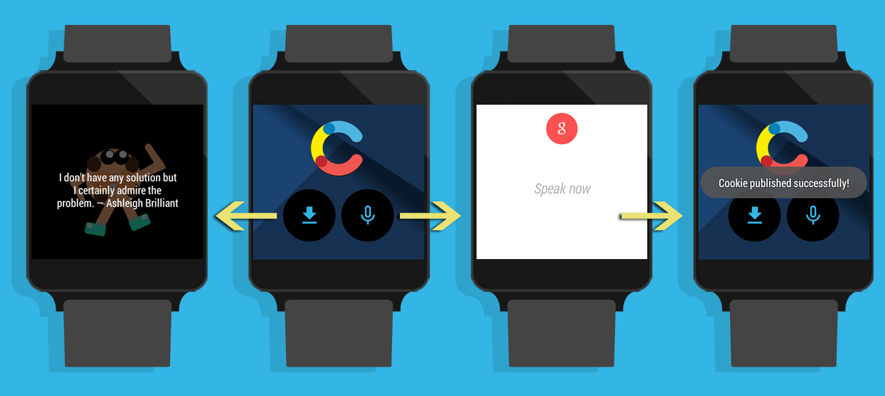

## CMA Cookies Demo

This app illustrates basic usage of the Management API SDK from the context of an Android Wear project.

## Intro:

> Contentful is the flexible content management platform that makes it easy to serve content to mobile and web applications. Manage your content with your team once and simply publish it to any screen. Contentful gives your editors an easy-to-use editing interface to collaborate on content and developers a well-documented API to easily set up your delivery channels. With this app, you can preview the content from your Contentful workspaces by simply inserting the space ID and password. This will give you a sense of how your data will look on a mobile device without any further styling done to it. If you don’t have a Contentful account yet, you can browse through some more information in this app and sign up for free. We look forward to your feedback :) Happy publishing!

## Screenshots

## Setup

In the Android SDK Manager, ensure that the following are installed, and are updated to the latest available version:
- Tools > Android SDK Platform-tools (rev 21 or above)
- Tools > Android SDK Tools (rev 24 or above)
- Tools > Android SDK Build-tools version 21 (rev 21.1.1 or above)
- Android 5.0 > SDK Platform (API 21)
- Android 4.4W.2 (Wear) > SDK Platform (API 20)
- Extras > Android Support Repository
- Extras > Android Support Library
- Extras > Google Play services
- Extras > Google Repository

Also, make sure to have JDK 7 installed on your machine, and configured in your IDE.

Next, log into the Contentful app and perform the following steps:
- Create a new Space.
  - Create a new Content Type within that Space.
    - Add a field of type TEXT to the Content Type, name it "text".
- Generate a Delivery API access token for this Space.
- Generate a Management API access token.
- Edit the "**config.xml**" file under the "**mobile/src/main/res**" folder. Example:

~~~xml
<?xml version="1.0" encoding="utf-8"?>
<resources>
  <string name="cf_space_id">SPACE-ID</string>
  <string name="cf_content_type_id">CONTENT-TYPE-ID</string>
  <string name="cf_token_cda">CDA-ACCESS-TOKEN</string>
  <string name="cf_token_cma">CMA-ACCESS-TOKEN</string>
</resources>
~~~

## Credits

- [Android Wear Device Frame PSD][3] by Cyril Mottier

## License

Copyright (c) 2014 Contentful GmbH. See [LICENSE.txt][2] for further details.

[1]: https://www.contentful.com
[2]: LICENSE.txt
[3]: http://cyrilmottier.com/2014/07/31/android-wear-flat-device-frame
